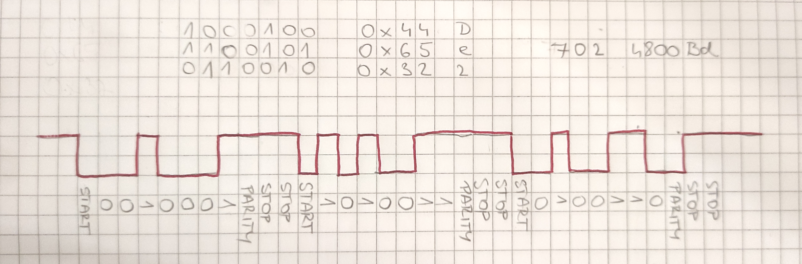
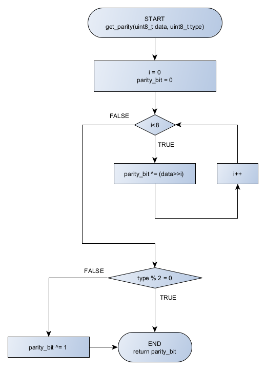
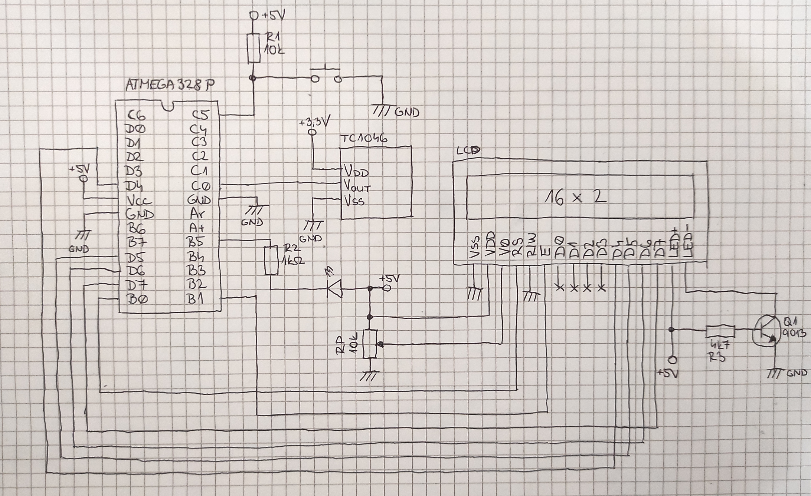

# Vypracovanie LAB_7 - Alexander Bekeč

Alexander Bekeč, 221096

Link to depository: [https://github.com/alexander-bekec/Digital-electronics-2](https://github.com/alexander-bekec/Digital-electronics-2)

### Analog-to-Digital Conversion

1. Complete table with voltage divider, calculated, and measured ADC values for all five push buttons.

   | **Push button** | **PC0[A0] voltage** | **ADC value (calculated)** | **ADC value (measured)** |
   | :-: | :-: | :-: | :-: |
   | Right  | 0&nbsp;V | 0 | 0 |
   | Up     | 0.495&nbsp;V | 101 | 99 |
   | Down   | 1.203&nbsp;V | 246 | 257 |
   | Left   | 1.970&nbsp;V | 403 | 410 |
   | Select | 3.182&nbsp;V | 651 | 641 |
   | none   | 5&nbsp;V | 1023 | 1023 |

2. Code listing of ACD interrupt service routine for sending data to the LCD/UART and identification of the pressed button. Always use syntax highlighting and meaningful comments:

```c
/**********************************************************************
 * Function: ADC complete interrupt
 * Purpose:  Display value on LCD and send it to UART.
 **********************************************************************/
ISR(ADC_vect)
{
    uint16_t value = 0;
    char lcd_string[] = "0000";
    char lcd_hexstr[] = "000";

    value = ADC;                  // Copy ADC result to 16-bit variable
    itoa(value, lcd_string, 10);  // Convert decimal value to string
    itoa(value, lcd_hexstr, 16);  // Convert hexadecimal value to string

    uart_puts(lcd_string);
    uart_puts("\n\r");
    uart_puts(lcd_hexstr);
    uart_puts("\n\r");
    
    lcd_gotoxy(8, 0); lcd_puts("        ");
    lcd_gotoxy(8, 0); lcd_puts(lcd_string);
    lcd_gotoxy(12, 0); lcd_puts(" ");
    lcd_gotoxy(13,0); lcd_puts(lcd_hexstr);
    
    lcd_gotoxy(8, 1); lcd_puts("        ");
    lcd_gotoxy(8, 1);
        
    if (value >= 0 && value < 51) {
        lcd_puts("right");
        uart_puts("right");
        uart_puts("\n\r");
    }
    else if (value >= 51 && value < 174) {
        lcd_puts("up");
        uart_puts("up");
        uart_puts("\n\r");
    }
    else if (value >= 174 && value < 325) {
        lcd_puts("down");
        uart_puts("down");
        uart_puts("\n\r");
    }
    else if (value >= 325 && value < 527) {
        lcd_puts("left");
        uart_puts("left");
        uart_puts("\n\r");
    }
    else if (value >= 527 && value < 837) {
        lcd_puts("select");
        uart_puts("select");
        uart_puts("\n\r");
    }
    else if (value >= 837 && value < 1024) {
        lcd_puts("none");
        uart_puts("none");
        uart_puts("\n\r");
    }
    else {
        lcd_puts("error");
        uart_puts("error");
        uart_puts("\n\r");
    }
    uart_puts("\n\r");
}
```

### UART communication

1. (Hand-drawn) picture of UART signal when transmitting three character data `De2` in 4800 7O2 mode (7 data bits, odd parity, 2 stop bits, 4800&nbsp;Bd).

   

2. Flowchart figure for function `uint8_t get_parity(uint8_t data, uint8_t type)` which calculates a parity bit of input 8-bit `data` according to parameter `type`. The image can be drawn on a computer or by hand. Use clear descriptions of the individual steps of the algorithms.

   

### Temperature meter

Consider an application for temperature measurement and display. Use temperature sensor [TC1046](http://ww1.microchip.com/downloads/en/DeviceDoc/21496C.pdf), LCD, one LED and a push button. After pressing the button, the temperature is measured, its value is displayed on the LCD and data is sent to the UART. When the temperature is too high, the LED will start blinking.

1. Scheme of temperature meter. The image can be drawn on a computer or by hand. Always name all components and their values.

   